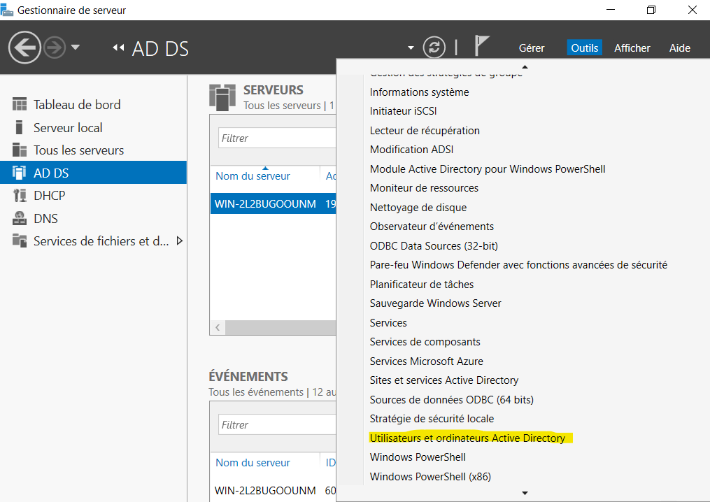

##### Sélectionnez Utilisateurs et Ordinateurs Active Directory  

  

##### Dans l'abre déroulant, sélectionnez le domaine wilders.lan  

  

##### Clique droit, ajouter un UO et définir wilders.students
##### Puis ajouter un groupe et définir Students
##### Puis ajouter un utilisateur et le définir (ici mon prénom et nom)

  

